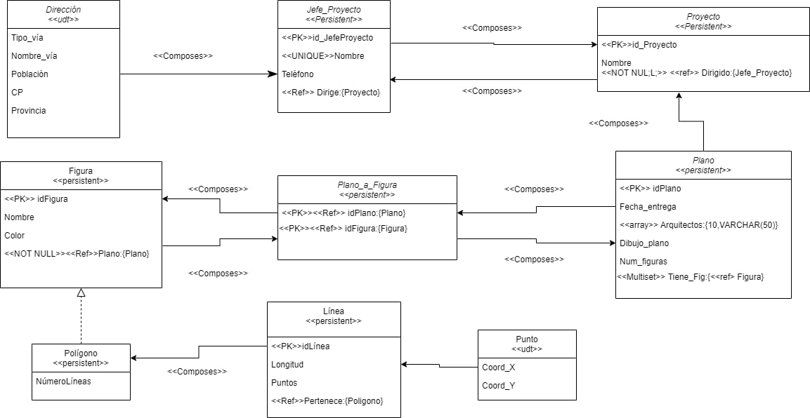
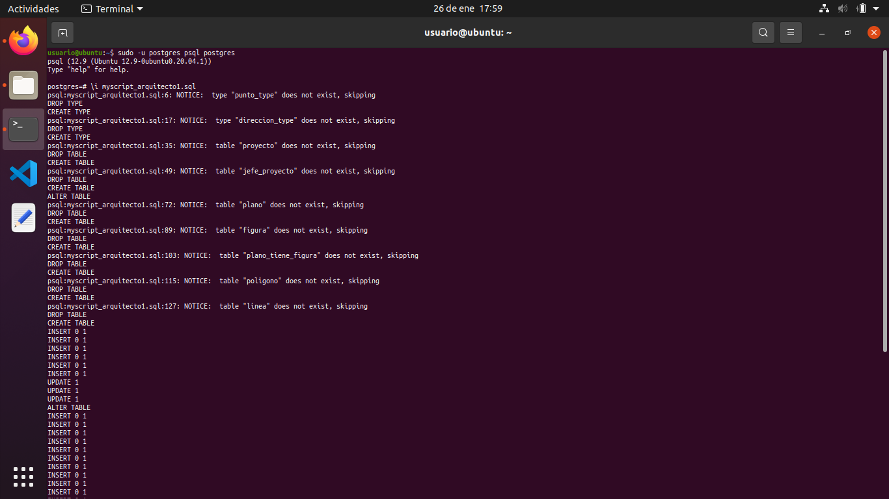
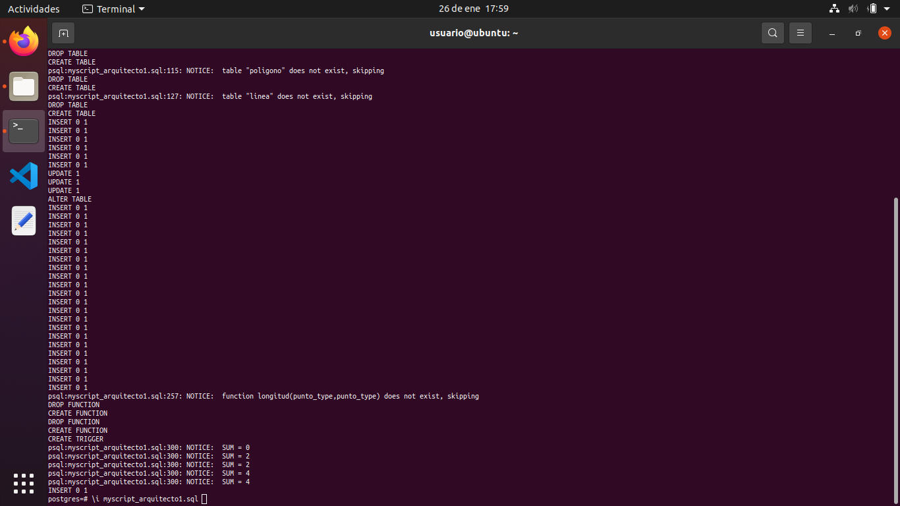
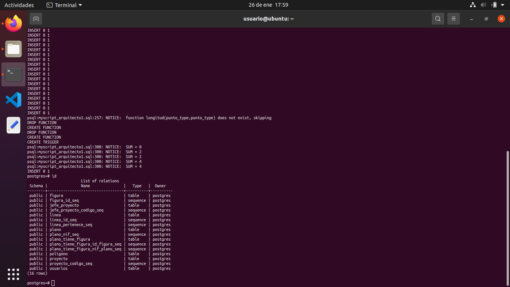
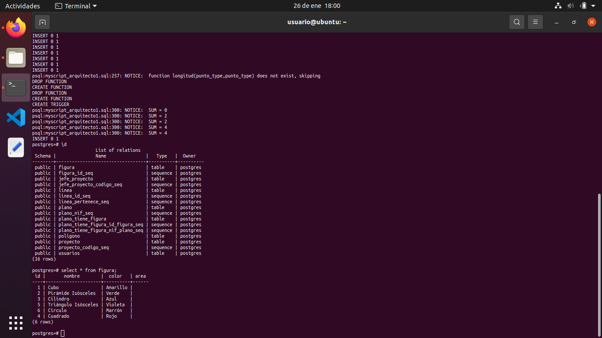
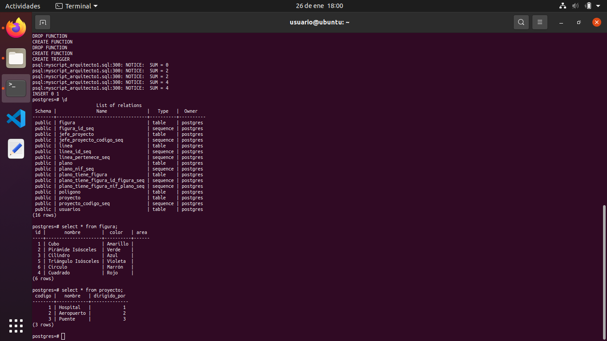
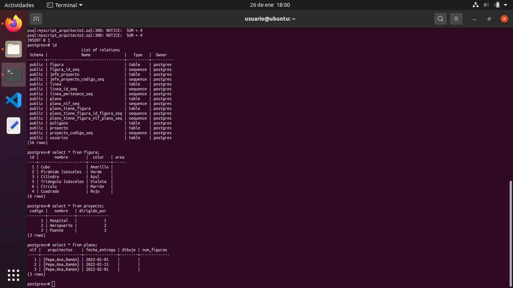
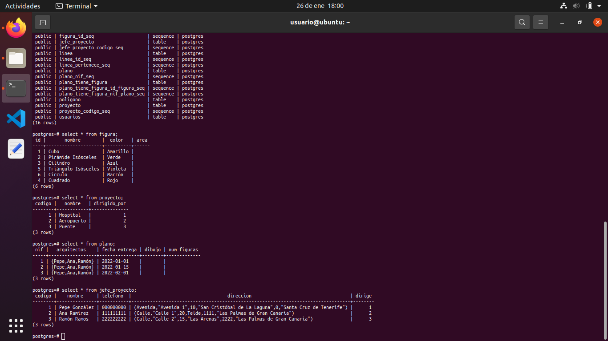

# Miembros del grupo
- Aram Pérez Dios (alu0101244488)
- Carlos García Lezcano (alu0101208268)
- Cristian Vilanova González (alu0101014968)
- Javier Herrera Serpa (alu0100830972)
- Antonella Garcia Alvarez (alu0101227610)

# Técnicas usadas

- Creación de tipos de datos
- Datos multievaluados
- Operaciones de datos
- Simular herencia en postgress
- Tipos compuestos

# Capturas de la ejecución

