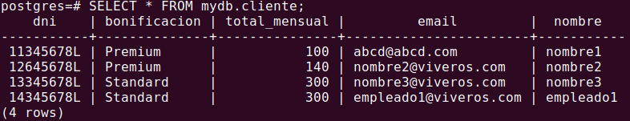
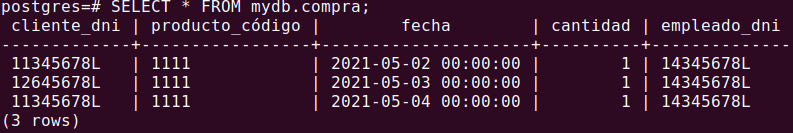
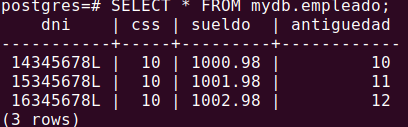
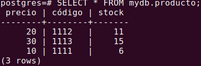
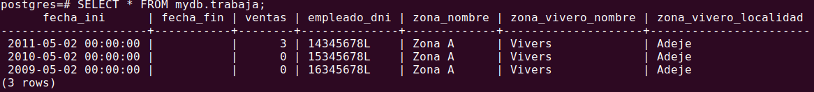
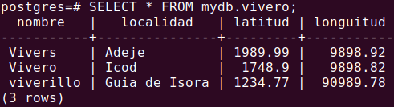
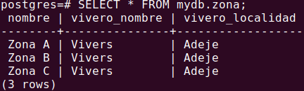
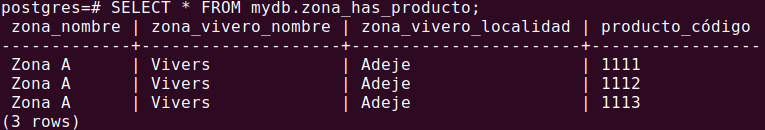

# Práctica vivero triggers

- El [fichero .sql](MyScriptSQL.sql) es el mismo que en la entrega anterior. Ha sido modificado por los integrantes del grupo para añadir las nuevas funcionalidades requeridas.

Además como el punto 2 solicitaba `Crear un disparador que permita verificar que las personas en el Municipio del catastro no pueden vivir en dos viviendas diferentes.` pero no era posible aplicarlo a nuestra base de datos de viveros, hemos decidido adaptarlo. Lo hemos convertido en `Un empleado no puede venderse ningún producto a si mismo`

Por último las imágenes de la salida de un Select realizado a cada tabla, dentro del directorio img e incluídas en este README

