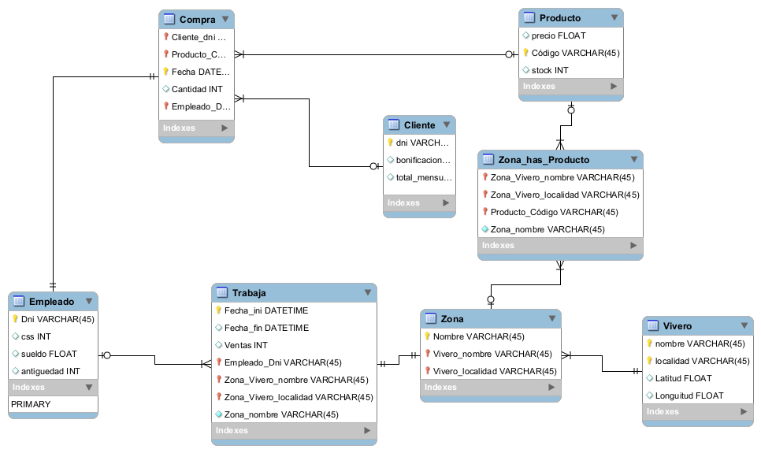
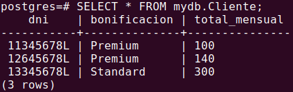
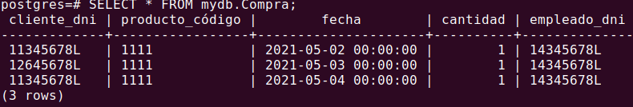
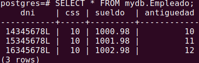
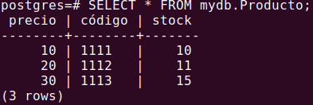
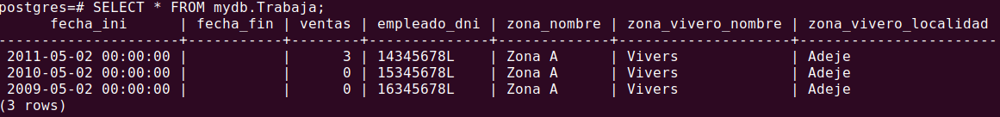
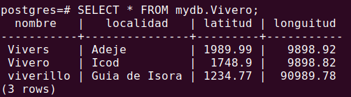
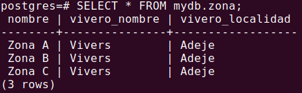

# Práctica vivero
Este es el esquema realizado en workbench:

Además en este mismo directorio se encuentra:
- El [fichero .mwb](Practica2_.mwb) se encuentra en este mismo repositorio.
- El [fichero .sql](MyScriptSQL.sql) generado por workbench y modificado por los integrantes del grupo para hacerlo compatible con Postgres

Además también incluye las imágenes de la salida de un Select realizado a cada tabla, dentro del directorio img e incluídas en este README

